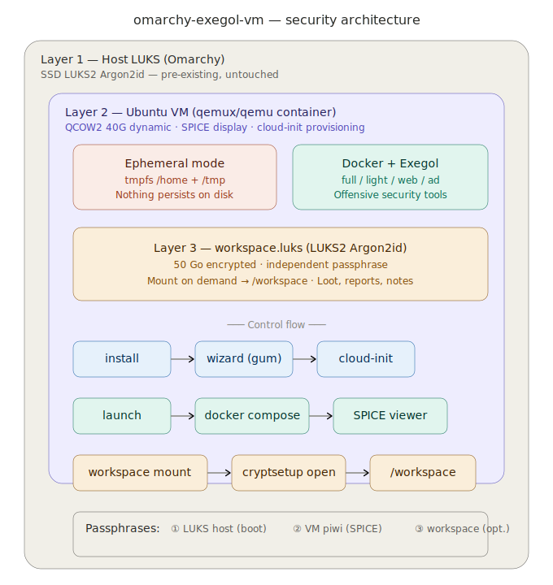

# omarchy-exegol-vm

  



Provides a secure, encrypted Exegol offensive-security VM for [Omarchy](https://github.com/basecamp/omarchy) using a dockerized QEMU environment. Ships with triple-layer encryption (host LUKS + ephemeral tmpfs + dedicated workspace LUKS), cloud-init automated setup, and full Hyprland/Walker integration.

Built following the pattern of [omarchy-kali-vm](https://github.com/reg1z/omarchy-kali-vm), adapted for Ubuntu Server + Docker + [Exegol](https://github.com/ThePorgs/Exegol).

## Installation

Available on the AUR:

```
yay -S omarchy-exegol-vm
```

After installation, run `omarchy-exegol-vm-integrate-os` to import the Hyprland windowrules and Omarchy menu entries. Undo with `omarchy-exegol-vm-unintegrate-os`.

## Features

- **Triple-layer encryption**: Host LUKS + ephemeral tmpfs + workspace LUKS2 Argon2id
- **Custom username**: Choose your VM login during setup
- **SSH access**: `omarchy-exegol-vm ssh` connects to the VM on port 2222
- **Shared folder**: `~/Exegol` on host ↔ `~/Exegol` in VM (via 9p virtio)
- **Clipboard sharing**: Copy/paste between host and VM via SPICE agent
- **Auto-resize display**: SPICE auto-resize with Hyprland workaround
- **Configurable disk**: Choose VM disk size (40G/80G/128G/256G)
- **Multiple Exegol images**: full, light, web, ad, osint, nightly
- **Ephemeral by default**: `/home` and `/tmp` on tmpfs — nothing persists
- **Encrypted workspace**: On-demand LUKS container for persistent mission data
- **Update command**: Update Exegol wrapper and images from the host
- **Debug mode**: `--debug` flag for install/remove with full report

## Commands

```
omarchy-exegol-vm install [--debug]     # First-time setup wizard
omarchy-exegol-vm launch [-k]           # Start VM + SPICE viewer
omarchy-exegol-vm stop                  # Graceful shutdown
omarchy-exegol-vm status                # Show VM status + login info
omarchy-exegol-vm ssh                   # SSH into running VM
omarchy-exegol-vm update                # Update Exegol inside VM
omarchy-exegol-vm workspace mount       # Mount encrypted workspace
omarchy-exegol-vm workspace umount      # Lock workspace
omarchy-exegol-vm finalize              # Remove ISO after first setup
omarchy-exegol-vm remove [--debug]      # Delete everything
omarchy-exegol-vm-integrate-os          # Add Omarchy menu + Hyprland rules
omarchy-exegol-vm-unintegrate-os        # Remove Omarchy integration
```

## Security Architecture

```
Host (Omarchy / Arch Linux)
└── LUKS2 Argon2id (full-disk, pre-existing)
    └── Docker: qemux/qemu container
        └── Ubuntu Server VM (QCOW2, SPICE)
            ├── tmpfs /home + /tmp (ephemeral, RAM-only)
            ├── Docker → Exegol containers (offensive tools)
            ├── ~/Exegol (shared folder via 9p, non-encrypted)
            └── /workspace (LUKS2 workspace, on-demand mount)
```

| Passphrase | When | Purpose |
|---|---|---|
| 1 | Host boot | LUKS host (Omarchy) |
| 2 | VM login / SSH | Ubuntu user password |
| 3 | `workspace mount` | workspace.luks (optional) |

## Disk Budget

| Component | Size |
|-----------|------|
| QCOW2 VM (dynamic) | 40-256 Go (configurable) |
| Exegol image `full` | ~25 Go |
| `workspace.luks` | 50 Go (configurable) |

## Dependencies

`docker` (compose plugin) · `virt-viewer` · `gum` · `cryptsetup` · `curl` · KVM (`/dev/kvm`)

## Cleanup

- Remove VM data: `omarchy-exegol-vm remove`
- Remove with debug retention: `omarchy-exegol-vm remove --debug`
- Remove Omarchy integration: `omarchy-exegol-vm-unintegrate-os`

See [docs/cleanup.md](docs/cleanup.md), [docs/security.md](docs/security.md), [docs/integration.md](docs/integration.md).

## Credits

Pattern from [omarchy-kali-vm](https://github.com/reg1z/omarchy-kali-vm) by [reg1z](https://github.com/reg1z). Exegol: [ThePorgs/Exegol](https://github.com/ThePorgs/Exegol).
